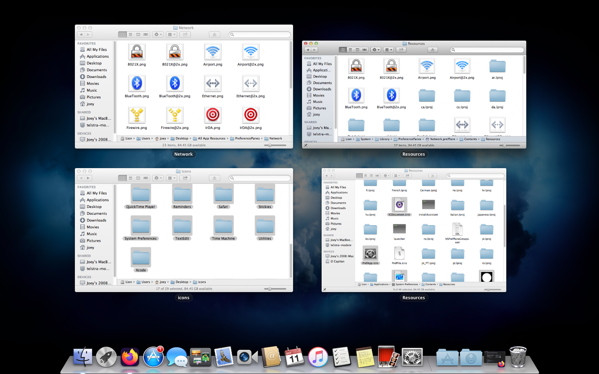

# Apple Icon Encyclopedia

Welcome to the Apple Icon Encyclopedia! A cool new resource for artists and theme makers everywhere :3

These icons are all in there original resolution and .ICNS (Apple icon format from before the clear/dynamic ones were introduced in macOS 26 Tahoe). You can easily convert them to PNG if you’d like but all the icons on here are made without any alterations to the original. In other words, I just ripped them from the files of macOS and iOS. Straight up. No changes.

You also may find custom icons made by me! Please give credit if you use my custom icons in your icon pack >w<

[YouTube Channel](https://youtube.com/@joeyplayssomegames)

[Official Telegram](https://t.me/JoeyPlaysSomeGames_yt)

# How I did the thing

I did it all manually because I dont know how to automate it. It takes ages. Literally Control+Click > “Show Package Contents” > Contents > Resources > then drag and command+C every single image. Then do that for all the apps, utilities, and preference panes…

…yay :( 

# Why?

Because it’s cool! And when I was trying to theme my MacBook, I didnt have a resource like this at all! I hope this helps someone making a theme pack, drawing their own icons, or even just getting nostalgia for a better time :3